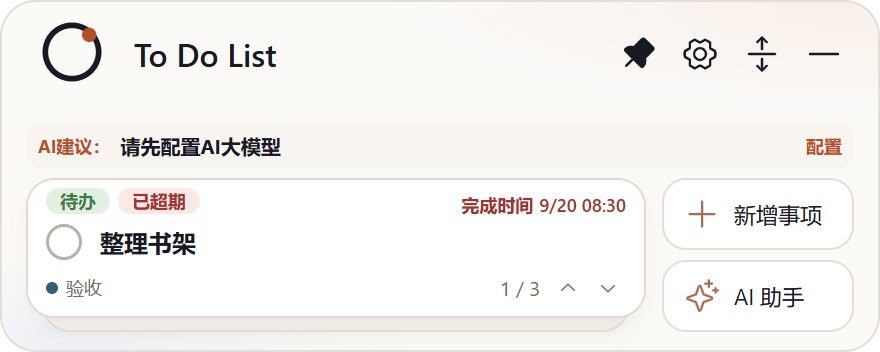
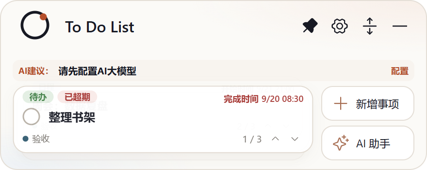

# Issue #2：收起状态下的卡片展示动效优化

- Issue：<https://github.com/zhshenry/To-Do-List/issues/2>
- 建档：2026-09-21
- 状态：已归档
- 类型：优化
- 涉及UI：是
- 分支：sdd/0002（worktree `../To-Do-List-sdd/0002`；**堆叠于 sdd/0001**）

## 背景（issue 要点 + 代码勘察结论）

**用户诉求**（issue 原文）：收起状态下点上下切换卡片时加切换动效——点下一个，当前卡往下往后、下一个往上往前，滚动式动画。

**代码勘察**（2026-09-21，基于 main `db00553` + sdd/0001 分支现状）：

- 翻页共三处触发，全部瞬时 `setIndex` 无动效：翻页按钮「上一项/下一项」（`MiniCard.tsx:465`）、背板点击（`:455`，等同下一项）、滚轮（`:454`）；另完成待办确认后自动翻页（`confirmComplete`）也是瞬时。
- 仓库既有动效语言：`cubic-bezier(.16, 1, .3, 1)`、220–300ms（`mini-content-settle` / `motion-from-left/right`）；`mini-card.css:337` 有 `prefers-reduced-motion` 全局熔断（`* { animation: none !important }`），纯 CSS 动画自动跟随系统设置，无需 JS 判断。
- 卡片叠层结构：front 卡（z:2）+ middle/back 背板（下沉 8/14px、缩进、变灰）——「往后」有现成的空间隐喻。

## 方案（交互演示见 [preview.html](./preview.html)——**请在浏览器打开实际点击体验**，静态帧见 [deck-roll-demo.png](./deck-roll-demo.png) 与 preview 内 storyboard）

**滚动式两层交叉动画，260ms，`cubic-bezier(.16, 1, .3, 1)`**：

- **下一项**：当前卡下沉后退（`translateY(11px) scale(.93)` + 淡出，即隐入背板位），下一张从背板位升起进前（同位移反向 + 淡入）——方向感与叠层空间一致；
- **上一项**：完全反向（当前卡上浮后退，上一张从上方落前）；
- 触发范围：翻页按钮、背板点击、滚轮、完成待办确认后的自动翻页，四处统一走同一 `page(delta)`；
- 滚动中连续操作：忽略（`rolling` 守卫，260ms 后恢复），不做队列避免眩晕；
- `prefers-reduced-motion`：由既有全局熔断覆盖，自动瞬切，零额外代码。

## 决策记录

- 2026-09-21 建档：待 spec 审批（动效方向语义、时长、触发范围如上，默认按推荐执行）。
- 2026-09-21 批准（聊天，用户：「可以」）：按推荐方案执行（260ms 两层交叉滚动、四处触发统一、reduced-motion 熔断）。
- 2026-09-21 基线偏离记录：分支 `sdd/0002` 堆叠于 `sdd/0001` 而非 main HEAD——两案同改 `MiniCard.tsx` 翻页区与 `mini-card.css` 同区段，#1 已验收且动效演示按 #1 后的界面制作，堆叠避免必现冲突。合入顺序：先 #1 后 #2；若 #1 合入则 #2 rebase 到 main 即可。
- 2026-09-21 **验收通过**（聊天，用户「满意」）：issue #2 以 completed 关闭（任务代关 + 收尾评论），档案归档。分支 `sdd/0002` 原地保留，与 `sdd/0001` 构成堆叠序列，等用户合入指令。

## 实现要点（动哪些文件、接口、风险）

- `src/MiniCard.tsx`：新增 `deckDir`/`deckRolling` 状态与 `page(delta)` 助手（换算 target、记录 outgoing 快照、270ms 后清理）；四处触发点改调 `page()`；滚动期间叠层渲染两层 `deck-layer`（incoming 当前 index + outgoing 快照），静止期单层不变。完成确认后的翻页复用 `page(1)`。
- `src/mini-card.css`：新增 `deck-out/in-next/prev` 四条 keyframes 与 `.stack-next/.stack-prev` 触发类、`.deck-layer` 定位；背板滚动期间短暂压暗（`sheet-dim`）增强进深感。
- 测试：`npm test` 回归 + `npm run build`；交互验证以 worktree 真机截图/录屏帧为准（章程第 7 节）；`npm run test:desktop` 冒烟回归。
- CHANGELOG：[未发布] 记一条。
- 风险：低——纯渲染层动画，无数据/契约改动；注意滚轮高频触发的守卫、以及 armed 状态下翻页先 disarm（现状已处理，保持）。

## 验收记录

- **交付 commit**：`847daa8` @ `sdd/0002`（含 `sdd/0001` 全部提交为基座），3 文件 +55/−17：`src/MiniCard.tsx`（`deck` 状态 + `page()` 助手统一四处触发；`deckCard(task, counter)` 抽取卡面渲染；滚动期渲染 incoming/outgoing 两层；完成待办后经 effect 快照触发同款「下一项」滚动）、`src/mini-card.css`（`deck-layer` 定位 + 四条 keyframes + 背板压暗）、`CHANGELOG.md`（[未发布] 条目）。
- **最终行为**：点「下一项」当前卡下沉后退（`translateY(11px) scale(.93)` + 淡出）、下一张从背板位升起进前，260ms `cubic-bezier(.16,1,.3,1)`；「上一项」反向；滚动中重复操作被守卫忽略；`prefers-reduced-motion` 由仓库全局熔断覆盖自动瞬切。
- **验证结果**：`npm test` 33/33 · `npm run build` 通过 · `npm run test:desktop` **passed** · 真机 4 帧截图（滚动前 / 「下一项」中点 / 落位 / 「上一项」中点，WAAPI 暂停定格捕获）见下方，中点帧可见两层交错。
- **真机动效帧**：

| 滚动前 | 「下一项」中点（130ms 定格） | 落位后 | 「上一项」中点 |
|---|---|---|---|
|  |  |  |  |

- **本地验证方法**：默认看上方帧序列与 [preview.html](./preview.html) 交互演示；有疑义先退出常驻实例再 `cd ../To-Do-List-sdd/0002 && npm start`（注意：本分支含 #1 的卡片改动，真机观感以本分支为准）。
- **合入提示**：先合 `sdd/0001`（#1），再合 `sdd/0002`（#2，基于前者）；若 #1 已入 main，`sdd/0002` 可直接 merge 或 rebase 到 main。
