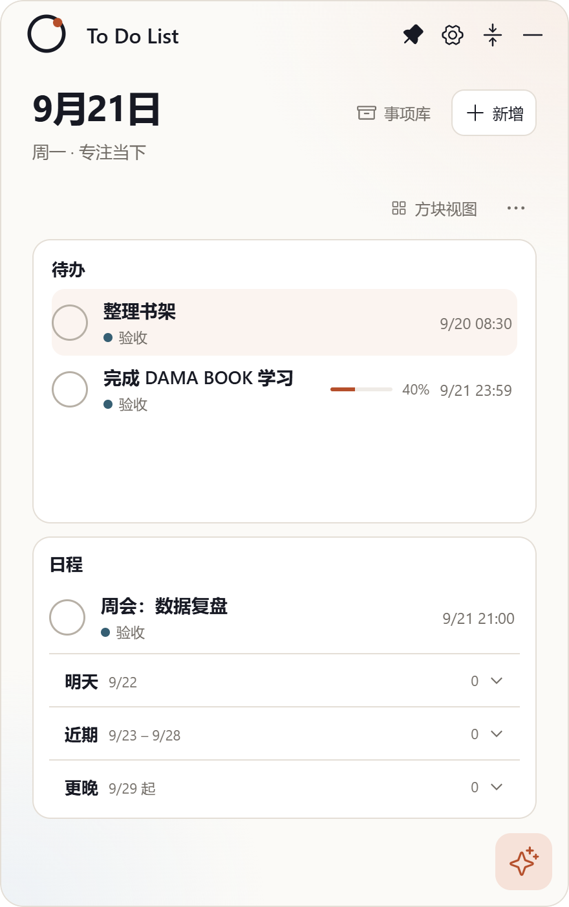
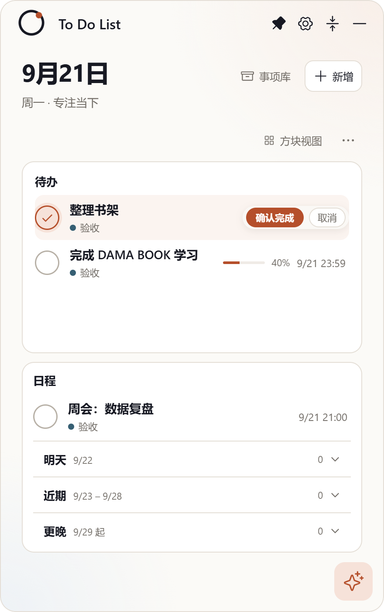
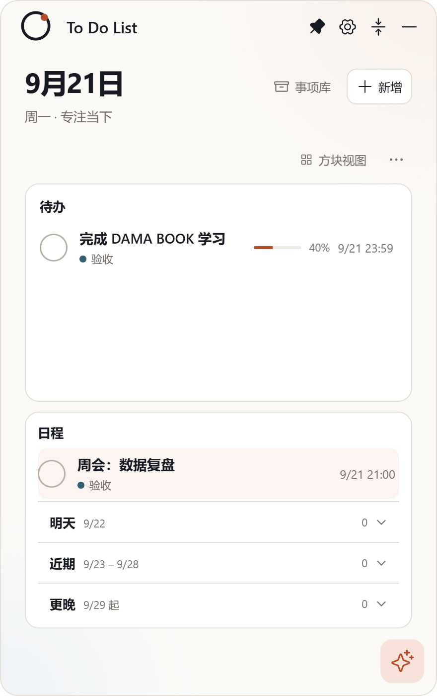

# Issue #6：展开状态下的事项参考收起状态下的事项优化

- Issue：<https://github.com/zhshenry/To-Do-List/issues/6>
- 建档：2026-09-21
- 状态：已归档
- 类型：优化
- 涉及UI：是
- 分支：sdd/0006（worktree `../To-Do-List-sdd/0006`，基于 main `204354e`）

## 背景（issue 要点 + 勘察结论）

**用户诉求**（issue + 截图）：展开态待办行 ① 勾选框改圆框（与收起卡一致）② 完成改双步确认 ③ 时间补齐日期（当前部分只有 23:59）④ 行样式整体向收起卡看齐。

**勘察**（main `204354e`）：

- `src/App.tsx` PlanRow（:228-239）：`task-check` 28px 方形（radius 7px，`styles.css:108`）；**单击直接 update status**（无确认）；`<time>` 只显示 `timeText(dueAt)`（HH:mm），日期仅在逾期/未来时挂在分类行。
- 收起卡参照物：`mini-task-check`（圆形、hover 品牌软底、armed 实心）、双步确认（armed → 确认完成/取消条，`ARM_RESET_MS=4000` 超时解除）、`scheduleStamp`（M/D HH:mm）、逾期红色。

## 方案（mockup 见 [board-row-redesign.png](./board-row-redesign.png)，已按用户意见修订 v2）

1. **圆框**：`task-check` radius 7px → 50%，边框色对齐收起卡（#b7b0a6），hover 品牌软底；完成态圆形灰底对勾。
2. **双步确认**：首次点击 → armed（**品牌色实心圆框内白色对勾** + 行内「✓ 确认完成 / 取消」确认条替代时间位）→ 仅点「确认完成」写入；**再次点击圆框 = 取消**（不写入，用户明确指定——注意与收起卡现状"二击确认"不同，统一化归 #10）；**4 秒超时自动解除**（同迷你卡 `ARM_RESET_MS`）；切换行/翻页自动解除。**恢复（已完成→待办）保持单击直接恢复，不加确认**。
3. **日期+时间**：`<time>` 改 `scheduleStamp`（M/D HH:mm），逾期转红加粗（同收起卡）；分类行不再重复挂日期。
4. **进度百分比**：进度条右侧显示数字（如 `35%`）。
5. **行样式**：完成行划线灰；pill、行高不变。

## 决策记录

- 2026-09-21 建档：mockup 单一推荐方案，无开放决策点（四点诉求逐条对应）；样式对齐收起卡为既定方向。
- 2026-09-21 修订（聊天，用户四点反馈）：① 进度条右侧显示百分比数字；② armed 态 = 品牌色实心圆框**内白色对勾**（v1 初稿圆框无勾，已改）；③ 点击逻辑明确为"再次点击圆框 = 取消，仅「确认完成」按钮写入"（与收起卡现状"二击确认"不同，差异统一化归 #10）；④ 确认 4 秒超时机制与收起卡同款（`ARM_RESET_MS=4000`）。
- 2026-09-21 **批准**（聊天，用户 `/approve`）：按 v2 修订方案实现。

## 实现要点（动哪些文件、接口、风险）

- `src/App.tsx` PlanRow：引入 armed 状态（单值 armedId + 超时定时器，与 MiniCard 同模式）；task-check 点击改 arm/confirm 两分支（仅待办，日程保持打开编辑？——日程行无勾选需求，维持现状）；`<time>` 改 scheduleStamp。
- `src/styles.css`：`.task-check` 圆形化 + armed 态 + `.confirm-bar` 样式（从 mini-card.css 平移适配）。
- 测试：`npm test` 回归；`npm run test:desktop` 需检查既有断言是否依赖"单击完成"行为（**风险点**：冒烟脚本若点击即完成，双步确认会改变断言路径——实现时核对并同步更新脚本与章程 §7 一致性）。
- 验收：真机截图四态（普通/armed/完成/逾期）。
- CHANGELOG：[未发布] 一条。

## 验收记录

- **交付 commit**：`c354bd1` @ `sdd/0006`（基线 main `204354e`），4 文件 +55/−12：`src/App.tsx`（PlanRow armed 状态/两分支点击/确认条/scheduleStamp/百分比）、`src/styles.css`（圆形化/armed 实心/确认条/逾期红）、`tooling/ux-smoke.mjs`（新增双步确认流程断言 + folder datetime 语义随新印章更新）、`CHANGELOG.md`。
- **逻辑要点**：点圆框 → armed（品牌实心+白勾+确认条）；再次点击圆框 = 取消（按你的指定，与收起卡现状不同——统一化归 #10）；仅「确认完成」按钮写入；4 秒超时自动解除；恢复保持单击。分类行日期仅逾期（跨天保留）时显示，其余日期统一右栏 M/D HH:mm。
- **验证**：`npm test` 34/34 · `npm run build` · `npm run test:desktop` **passed**（含新增双步确认流程断言）。
- **真机截图**：普通态  · armed 确认态  · 确认后离卡 。
- **Jev accept 门**：`deny:ui` → `HUMAN_REVIEW`（UI 类不自动放行，未调用 Jev）。期间顺带修复引擎守卫截停 bug 与 deny 判定顺序（身份类 deny 前置于证据采集）。
- 2026-09-22 **验收通过 + 预合并**（聊天，用户「好的合入吧」）：状态核验（head/base 未漂移）→ `_integrate` 试合 + 34/34 → 树哈希一致（`d59be32`）→ 主干合并 `0fcb439` → 合并后**重建 dist 再冒烟 passed**。流程改进：发现"合并后不重建 dist 则冒烟测旧应用"的缺口，已写入章程 §6.6（main 合并后先 build 再冒烟）。分支/工作树清理完成，关单归档。
