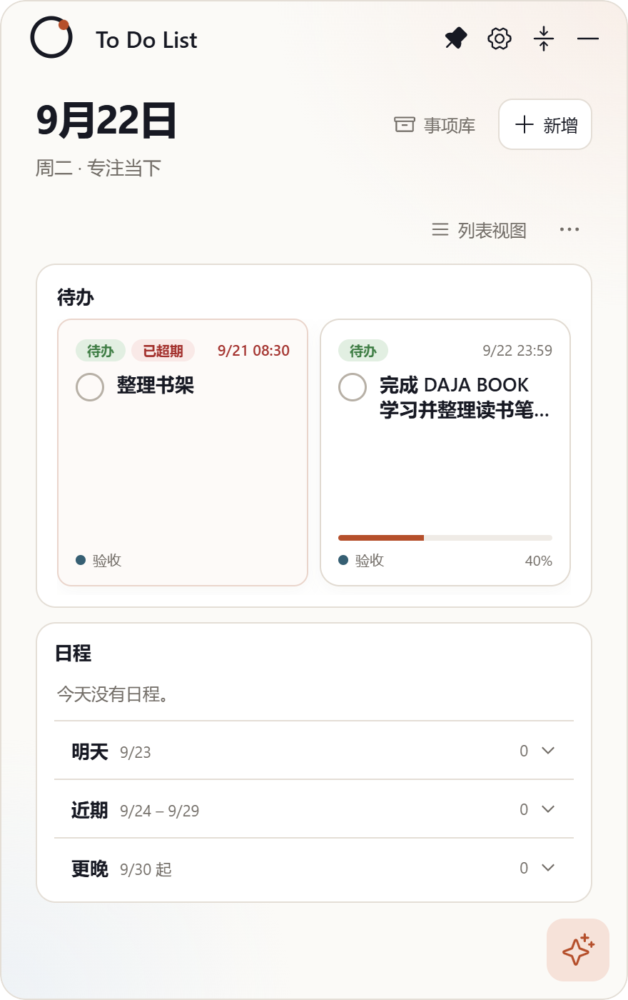
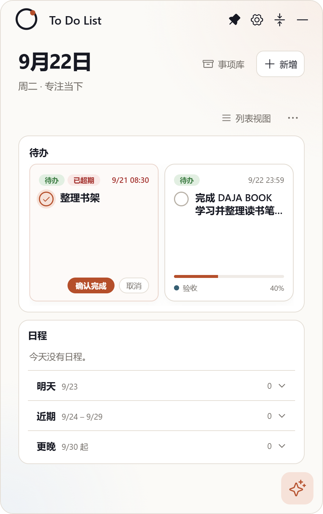

# Issue #7：方块视图下格式问题

- Issue：<https://github.com/zhshenry/To-Do-List/issues/7>
- 建档：2026-09-22
- 状态：已归档
- 类型：优化
- 涉及UI：是
- 分支：sdd/0007（worktree `../To-Do-List-sdd/0007`，基于 main `204354e`——#6 已合入，无需堆叠）

## 背景（issue 要点 + 勘察结论）

**用户诉求**（issue + 截图）：① 方块视图格式超出卡片范围，整体优化；② 选择框、超期标识、时间日期参照收起卡。

**勘察**（main `204354e` + sdd/0006）：tiles（`styles.css:102-125`）是把行视图元素塞进列向卡片的折行拼凑——勾选框悬在卡外、标题无行数钳制（长标题撑破卡片）、时间挤底部、无类型/超期徽章、无进度百分比。#6 已给行视图补齐圆框/双步确认/scheduleStamp；tiles 需整体重排为收起卡同款语言。

## 方案（mockup 见 [tiles-redesign.png](./tiles-redesign.png)：现状破碎 vs 新设计四态）

瓦片结构重排（收起卡同款语言，`overflow:hidden` 根治溢出）：

1. **顶行**：类型徽章（待办绿/日程蓝灰）+ 超期红徽章 + **右上时间** `M/D HH:mm`（逾期转红，同 #6）；
2. **主体**：20px 圆框勾选（#6 语义：armed 实心白勾、再点取消、4 秒超时；日程瓦片为摄像头圆钮进编辑）+ **标题两行截断**（line-clamp 2 + anywhere 换行）；
3. **底行**：分类（圆点+名，无分类显示 优先级）+ **进度百分比**（右对齐）；
4. **进度条**：3px 细条贴底（同收起卡 plan-progress）；
5. **armed 确认条**：**占底行位置右对齐**（同收起卡 front-meta 语言；armed 时底行分类/百分比让位），非浮层；
6. 完成瓦片：划线灰 + 灰底对勾 + 时间灰显（同 #6 行视图语义）；
7. **底行只显示分类**（圆点+名），不显示优先级（用户明确：优先级不用显示）。

## 决策记录

- 2026-09-22 建档：mockup 单一推荐方案，无开放决策点（"参照收起卡"即设计规范）；armed 语义沿用 #6 已批准交互。
- 2026-09-22 用户打回（GitHub /reject + 截图，00:55）：① 确认完成/取消**位置不对**（v1 浮层悬空）→ 改为**占底行右对齐**（同收起卡，底行内容让位）；② 底行**优先级不用显示** → 只留分类。mockup v2 已修订。
- 2026-09-22 **批准**（用户在 issue 贴 v2 渲染截图确认 + 聊天「我评论了，你继续执行吧」）：按 v2 实现。
- 2026-09-22 **验收通过 + 预合并**（GitHub /approve 评论 5769996616，经 issue-commands.mjs 代码验证）：状态核验 → `_integrate` 试合 + 34/34 → 树哈希一致（`361f2d7`）→ 主干合并 `261a562` → §6.6 先 build 再冒烟 passed → 清理 → 关单归档。

## 实现要点

- `src/App.tsx` PlanRow：tiles 分支重写为瓦片结构（顶行徽章/主体/底行/进度条；确认条浮层）；徽章复用 mini-pill 样式类。
- `src/styles.css`：`.is-tile` 区段整体重写（overflow hidden、tile-top/tile-body/tile-foot、armed 浮层）；行视图规则不动。
- 测试：`npm test` 回归；`test:desktop` 增补瓦片断言（切方块视图 → 徽章/两行截断/armed 流程/时间格式）；真机四态截图。
- 风险：与 #6 同文件堆叠——#6 合入后 rebase 即可；瓦片窄宽度下徽章+长时间的顶行需 nowrap+ellipsis 保护。
- CHANGELOG：[未发布] 一条。

## 验收记录

- **交付 commit**：`0f027eb` @ `sdd/0007`（基线 main `204354e`，含 #6 全部改动），4 文件 +55/−10：`src/App.tsx`（PlanRow tiles 分支独立瓦片结构：tile-top 徽章+时间戳 / tile-body 圆框+两行标题 / tile-foot 分类+百分比 / armed 确认条占底行）、`src/styles.css`（is-tile 区段重写 + **列向容器进度条 flex 修复**——flex-basis 100% 在列向会把 4px 进度条撑成巨块，实测发现）+ 旧规则清理、`tooling/ux-smoke.mjs`（新增方块视图断言：徽章/时间戳/百分比/切换；folder datetime 语义随新印章更新）、`CHANGELOG.md`。
- **验证**：`npm test` 34/34 · `npm run build` · `npm run test:desktop` **passed**（含新断言）。
- **真机截图**：普通态（双徽章逾期红时间/两行截断/进度条+40%） · armed 态（确认条占底行右对齐）。
- **Jev accept 门**：`deny:ui` → `HUMAN_REVIEW`（UI 类不自动放行）。
- **验收方式（严格制）**：评论 `/approve` 或聊天说验收通过 → 预合并收尾。
