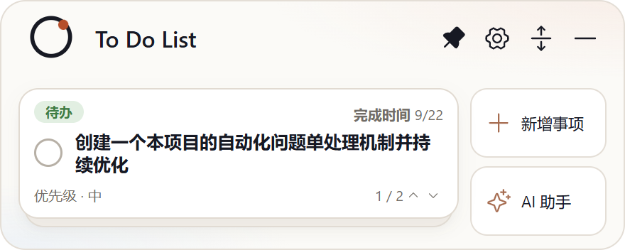

# Issue #8：收起状态下卡片里事项名称过大

- Issue：<https://github.com/zhshenry/To-Do-List/issues/8>
- 建档：2026-09-22
- 状态：已归档
- 类型：优化
- 涉及UI：是
- 分支：sdd/0008（基于 main `708e1a7`）

## 背景（issue 要点 + 勘察结论）

**用户诉求**（issue + 截图）：收起卡事项名称字号过大，调小。

**勘察**（main `261a562`）：标题字号 `.mini-task-open > b` 为 **14px**（`mini-card.css:59`，行高 1.25）；紧凑变体（带 AI 建议条）12px 不受影响。14px 两行在 92px 卡面占比过重，长标题截断频繁。

## 方案（A/B 对比见 [title-font-a-b.png](./title-font-a-b.png)）

- 标准变体：`14px → 12.5px`，行高 `1.25 → 1.3`（补偿小字号可读性）；
- 紧凑变体 12px 不变；字号仍为卡内最大文本元素，层级不倒挂；
- 收益：同两行位置多容纳约 4 字，长标题截断减少（A/B 图实测：样例标题 14px 丢失尾部 6 字，12.5px 完整显示）。

## 决策记录

- 2026-09-22 建档：单一参数修改，无开放决策点。
- 2026-09-22 **批准**（issue 评论 `/approve`，zhshenry 11:16，来源:用户(/approve)）：按 A/B 图 12.5px 方案实现。
- 2026-09-22 **accept 门**：`deny:ui` → `HUMAN_REVIEW`（UI 类不自动放行，未调用 Jev，无概率表；记录见 jev-ledger.jsonl）。
- 2026-09-22 **验收通过 + 预合并**（issue 评论 `/approve` 19:18，19:24 复核一票同效，来源:用户(/approve)）：状态核验（head `e7a96c4`/base `708e1a7` 未漂移）→ `_integrate` 试合 + 测试全绿 → 树哈希一致（`af86d0e`）→ 主干合并 `2e64113` → 合并后先 build 再冒烟 passed。分支/工作树清理完成，关单归档（8/8 单闭环）。

## 实现要点

- `src/mini-card.css:59`：`font-size: 14px → 12.5px`，`line-height: 1.25 → 1.3`。仅此一行。
- 验证：`npm test` 回归 + `build` + `test:desktop`（新增/既有断言不含字号）；真机截图对比。
- CHANGELOG：[未发布] 一条。
- 风险：极低。

## 验收记录

- **交付 commit**：`e7a96c4` @ `sdd/0008`（基线 main `708e1a7`），2 文件 +5/−1：`src/mini-card.css`（标准变体标题 `14px→12.5px`、行高 `1.25→1.3`，紧凑变体 12px 不动）+ `CHANGELOG.md`（[未发布] 一条）。
- **验证**：`npm test` 36/36 · `npm run build` · `npm run test:desktop` **passed**。
- **真机截图**：——A/B 图 23 字样例标题两行完整显示（14px 时尾部丢 6 字），与方案承诺一致；截图脚本 [capture-real.mjs](./capture-real.mjs)（worktree 内运行，假 provider+model 促成标准变体）。
- **Jev accept 门**：`deny:ui` → `HUMAN_REVIEW`（UI 类人工终审，来源:jev(v2, deny:ui 未调用命题)）。
