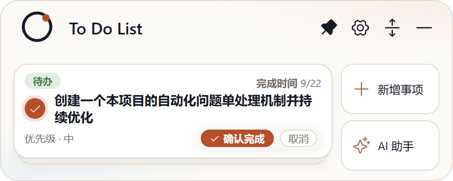

# Issue #9：收起状态下确认完成按钮过大

- Issue：<https://github.com/zhshenry/To-Do-List/issues/9>
- 建档：2026-09-22
- 状态：已归档
- 类型：优化
- 涉及UI：是
- 分支：sdd/0009（基于 main `2e64113`）

## 背景（issue 要点 + 勘察结论）

**用户诉求**（issue + 截图）：收起状态确认完成按钮过大、与上方文字重叠；要求做扁、做窄，取消按钮与其同高。

**勘察**（main `708e1a7`）：

- issue 截图摄于 2026-09-21（0.5.5 布局）——0.5.6 起确认条已移至卡底行独占（armed 时替换右下翻页器），**与标题重叠已不存在**；
- 遗留问题成立：确认 pill 实测渲染高 **≈26.5px**（`min-height:20px` + padding/边框），是底行「优先级 · 中」文字的约 2.5 倍；两枚按钮合计宽 136px，底行拥挤；实心大色块视觉权重过重；
- 现状真机截图：[armed-current.png](./armed-current.png)（worktree 构建，含 #8 的 12.5px 标题；按钮部分与 main 一致）。

## 方案（A/B 对比见 [confirm-btn-a-b.png](./confirm-btn-a-b.png)）

仅收紧 `.confirm-btn` / `.confirm-cancel` 两行 CSS，样式语义不变（确认仍实心 accent、取消仍白底描边）：

- `.confirm-btn`：`min-height 20→17px`、`padding 2px 10px→1px 8px`、`font-size 10.5→10px`（Check 图标 10→9）→ pill 渲染高 ≈19px（−28%），两按钮合计宽 ≈112px（−24px）；
- `.confirm-cancel`：`min-height` 同步 17px、`padding 1px 7px`——与确认按钮**严格同高**（诉求②）；
- 不动布局、不动交互逻辑（双步确认语义 0.5.9 已统一：再点圆框=取消）。

## 实现要点

- `src/mini-card.css:90-92`：上述两行参数。
- 验证：`npm test` + `npm run build` + `npm run test:desktop`（既有断言不含按钮尺寸）；真机 armed 态截图对比。
- CHANGELOG：[未发布] 一条。
- 风险：极低；触达面积仅收起卡 armed 态。

## 决策记录

- 2026-09-22 建档：诉求②（取消同高）现状已满足（两按钮同 20px），本 spec 将其在收缩后继续保持；重叠部分已由 0.5.6 底行布局解决，spec 范围收敛为「压扁压窄」。
- 2026-09-22 **spec 门**：`deny:ui` → `HUMAN_REVIEW`（UI 类硬政策，未调用 Jev，无概率表），置 spec待审。
- 2026-09-22 **批准**（issue 评论 `/approve` 19:28，来源:用户(/approve)）：按 A/B 提案实现（pill 20→17px、padding 1/8、字号 10px，取消同高）。
- 2026-09-22 **accept 门**：`deny:ui` → `HUMAN_REVIEW`（UI 类不自动放行，未调用 Jev，无概率表）。
- 2026-09-22 **验收通过 + 预合并**（issue 评论 `/approve` 20:18，来源:用户(/approve)）：状态核验（head `d68cfb2`/base `2e64113` 未漂移）→ `_integrate` 试合 + 36/36 → 树哈希一致（`db87602`）→ 主干合并 `f94e3ae` → 合并后先 build 再冒烟 passed。分支/工作树清理完成，关单归档。

## 验收记录

- **交付 commit**：`d68cfb2` @ `sdd/0009`（基线 main `2e64113`），3 文件 +5/−4：`src/mini-card.css`（确认/取消按钮加 `.mini-root` 作用域并收紧为 17px/10px/padding 1px 8px·1px 7px/line-height 1）、`src/MiniCard.tsx`（Check 图标 10→9）、`CHANGELOG.md`（[未发布] 一条）。
- **实现中发现并修正**：收起卡确认条此前实际套用的是 `styles.css:144-147` 展开行同款（22px/11px，#6 引入），mini-card.css 的同名规则被层叠遮蔽——spec 勘察时的「20px」基线即为误读。本单将收起卡规则以 `.mini-root` 作用域（0,2,0）压过共享基座（0,1,0）收紧为 17px，**展开行确认条不受影响**（维持 22px）；`line-height:1` 对齐 `.mini-pill` 惯例（否则 `button{font:inherit}` 继承行高会把行盒垫高）。
- **验证**：`npm test` 36/36 · `npm run build` · `npm run test:desktop` **passed**。
- **真机截图**：——按钮实测 17px（确认 71px + 取消 36px 宽，严格同高；此前 22px/121px）；计算样式经 probe 脚本核验（min-height 17/font 10/padding 1px）。截图脚本 [capture-real.mjs](./capture-real.mjs)。
- **Jev accept 门**：`deny:ui` → `HUMAN_REVIEW`（UI 类人工终审，来源:jev(v2, deny:ui 未调用命题)）。
