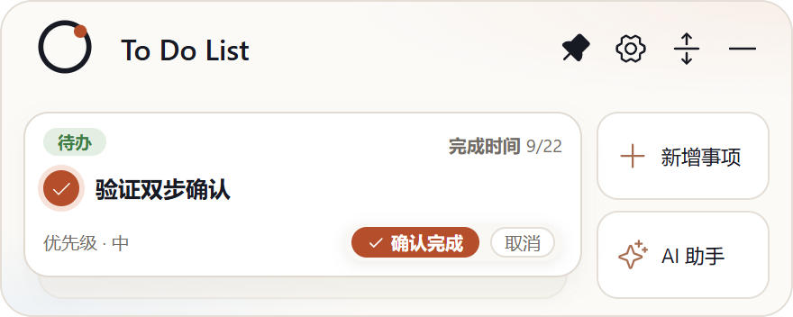
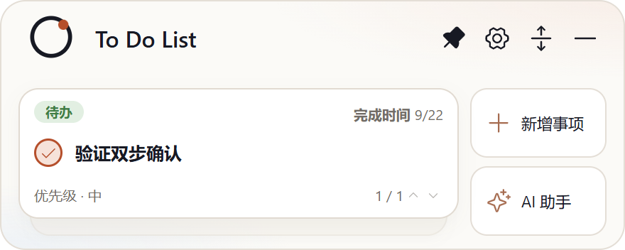

# Issue #10：收起状态下确认完成方式统一化

- Issue：<https://github.com/zhshenry/To-Do-List/issues/10>
- 建档：2026-09-22
- 状态：已取消
- 类型：优化
- 涉及UI：是
- 分支：（无——spec 为零改动提案）

## 背景（issue 要点 + 勘察结论）

**用户诉求**（issue + 截图，2026-09-21）：收起卡点击圆圈后出现两种确认方式（再点圆圈 / 「确认完成」按钮）；希望**只能通过「确认完成」按钮写入完成**，再次点击圆圈应回到未打勾状态。

**勘察**（main `2e64113`）：该诉求**已由用户自己的 0.5.9 发布实现**——

- 0.5.9 CHANGELOG：「完成确认对齐：收起卡再次点击圆框改为取消，只有『确认完成』才写入」；
- 代码证据：`src/MiniCard.tsx:446-448`——`completeCurrent() { if (armed) { disarmArm(); return; } armComplete(); }`（armed 时再点圆框仅解除确认态）；写入仅经 `confirmComplete`（「确认完成」按钮，:466）；
- 真机行为验证（2026-09-22，构建产物 + 临时数据目录）： 点圆框 → 确认条出现； 再点圆框 → 确认条消失、翻页器复位、任务保持 todo（程序断言 `status === 'todo'`）——与诉求逐字吻合。

## 方案（零改动提案）

**无需任何代码改动**。现状即诉求：与 #6 展开行「再点圆框 = 取消」语义已统一（这正是本单标题「统一化」的目标）。建议用户对照上述两张真机截图确认；确认无误后**直接关闭本单**或评论 `/discard` 即可（严格制下网页关闭 = 终止信号，流水线将置「已取消」归档，不含贬义）；若发现与诉求不符之处，评论 `/reject <差异描述>` 打回重做 spec。

## 实现要点

- 无（零改动）。

## 决策记录

- 2026-09-22 建档：勘察结论 0.5.9 已实现本单诉求，spec 收敛为零改动提案（附真机证据对 + 代码行号）。
- 2026-09-22 **spec 门**：`deny:ui` → `HUMAN_REVIEW`（UI 类硬政策，未调用 Jev，无概率表），置 spec待审。
- 2026-09-22 **/discard**（issue 评论 20:20，来源:用户(/discard)）：用户对零改动提案（现状即诉求）表示认可，整单取消——无需动工，置「已取消」归档并以 not planned 关单。

## 验收记录

（无需实现交付；用户确认后关单归档）
