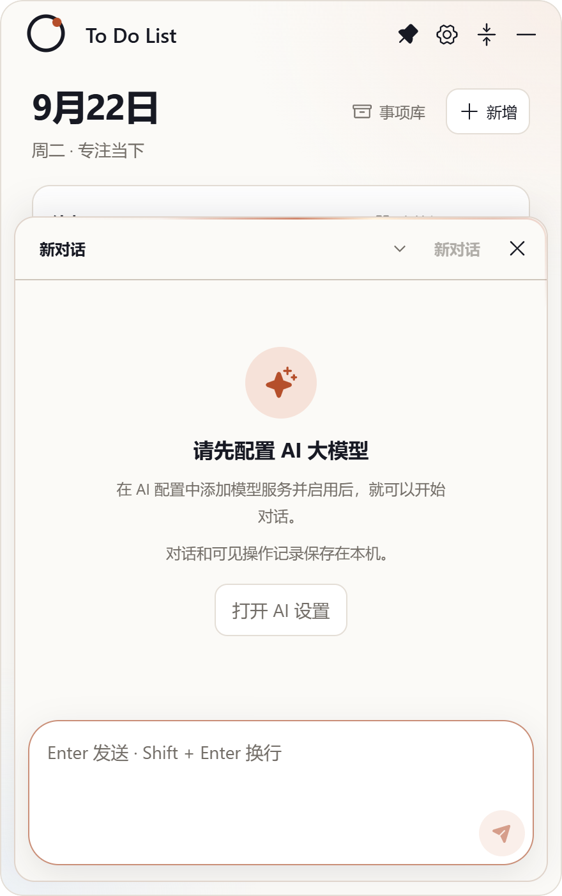

# Issue #12：展开模式下点击右下角的"打开AI助手"的若干问题

- Issue：<https://github.com/zhshenry/To-Do-List/issues/12>
- 建档：2026-09-22
- 状态：已归档
- 类型：优化
- 涉及UI：是
- 分支：sdd/0012（基于 main `776c38a`）

## 背景（issue 要点 + 勘察结论）

**用户诉求**（issue + 两张截图）：展开模式打开 AI 助手面板后——① 收起有从上往下消失动效，打开没有从下往上的展开动效；② 打开时主页面内容（标题/logo/按钮/日期/待办）明显上下抖动；③ 希望给助手面板加边框流光，参考折叠态 AI 助手。

**勘察**（main `f94e3ae`，含 0.5.9）：

- **①②疑似已被 0.5.9 解决**：0.5.9「主窗口 AI 打开」条目称「对话栏只从下往上盖住内容，后面的待办不再跟着动」；代码证据——`assistant-updates.css:7` 开启动效 `assistant-overlay-in 240ms`（`translateY(110%)→0` 自下而上滑入，与收起 180ms 对称）；面板为 `position:absolute` 覆盖 + `contain:layout paint`（`assistant-updates.css:1-8`），主内容不参与其布局，无抖动路径。**用户截图可能摄于旧构建**（应用单实例常驻，升级需重启）——需用户重启到 0.5.9 后核验；
- **③现版确实没有**：0.5.9 因「横扫光 + 会留残线的流光边」移除了旧流光；现 `.assistant-overlay` 无任何边框光效。而折叠卡的 `mini-ai-surface::before`（`mini-card.css:250`，`@property --mini-glow-angle` + conic-gradient 亮弧 + `mask-composite:xor` 1.5px 边框环）线上稳定、无残线问题——即用户点名想要的参照物。

## 方案（见 [assistant-glow-proposal.png](./assistant-glow-proposal.png)）

- **③本单实现**：`src/assistant-updates.css` 给 `.assistant-overlay` 加 `::before` conic 流光边——移植 `mini-ai-surface::before` 全套技法（`@property --assistant-glow-angle` 注册角度 → 3.2s/圈旋转亮弧；`mask-composite` 只留 1.5px 圆角边环；`drop-shadow` 微光；`pointer-events:none`；跟随系统「减弱动态效果」时静止为静态亮边）。**单文件纯样式，不动布局与逻辑，不复活旧横扫实现**；
- **①②转核验**：不重复实现已有能力。用户重启应用到 ≥0.5.9 后确认——若仍有抖动/动效异常，`/reject` 附现象描述，重新立项排查。

## 实现要点

- `src/assistant-updates.css`：`@property --assistant-glow-angle` + `.assistant-overlay::before` + `@keyframes assistant-border-glow` + `@media (prefers-reduced-motion: reduce)` 静态化。仅此一文件。
- 验证：`npm test` + `npm run build` + `npm run test:desktop` 回归；真机截图（打开面板 + 流光边帧）。
- CHANGELOG：[未发布] 一条。
- 风险：低——纯装饰样式；conic-gradient/@property 在应用 WebView（Chromium）可用（折叠卡已用同技法）。

## 决策记录

- 2026-09-22 建档：①②与 0.5.9 已有能力重合，spec 收敛为「③新增流光 + ①②重启核验」；流光实现选移植折叠卡技法而非复活旧横扫（残线前科）。
- 2026-09-22 **spec 门**：`deny:ui` → `HUMAN_REVIEW`（UI 类硬政策，未调用 Jev，无概率表），置 spec待审。
- 2026-09-22 **批准**（issue 评论 `/approve` 23:35，来源:用户(/approve)）：按提案实现③（conic 流光边）；①②按 spec 转重启核验。
- 2026-09-22 **accept 门**：`deny:ui` → `HUMAN_REVIEW`（UI 类不自动放行，未调用 Jev，无概率表）。
- 2026-09-22 **验收通过 + 预合并**（issue 评论 `/approve` 23:51，来源:用户(/approve)）：状态核验（head `d3809a7`/base `776c38a` 未漂移）→ `_integrate` 试合 + 37/37 → 树哈希一致（`a5155a1`）→ 主干合并 `c49d633` → 合并后先 build 再冒烟 passed。分支/工作树清理完成，关单归档（①②由用户重启后随本单验收一并确认）。

## 验收记录

- **交付 commit**：`d3809a7` @ `sdd/0012`（基线 main `776c38a`），2 文件 +5 行：`src/assistant-updates.css`（`@property --assistant-glow-angle` + `.assistant-overlay::before` conic 流光 + `assistant-border-glow` 3.2s/圈）、`CHANGELOG.md` 一条。减弱动效由全局 `styles.css:515` 覆盖（动画自动静止）。
- **验证**：`npm test` 37/37 · `npm run build` · `npm run test:desktop` **passed**。
- **真机截图**：——程序断言面板 `::before` 的 `animation-name: assistant-border-glow` 生效，顶边可见暖色亮弧（旋转中的一帧）。截图脚本 [capture-real.mjs](./capture-real.mjs)。
- **①②核验提示**：开启动效与主内容抖动按 spec 由用户重启应用到 ≥0.5.9 后核验；若仍异常请 `/reject` 附现象描述。
- **Jev accept 门**：`deny:ui` → `HUMAN_REVIEW`（UI 类人工终审，来源:jev(v2, deny:ui 未调用命题)）。
