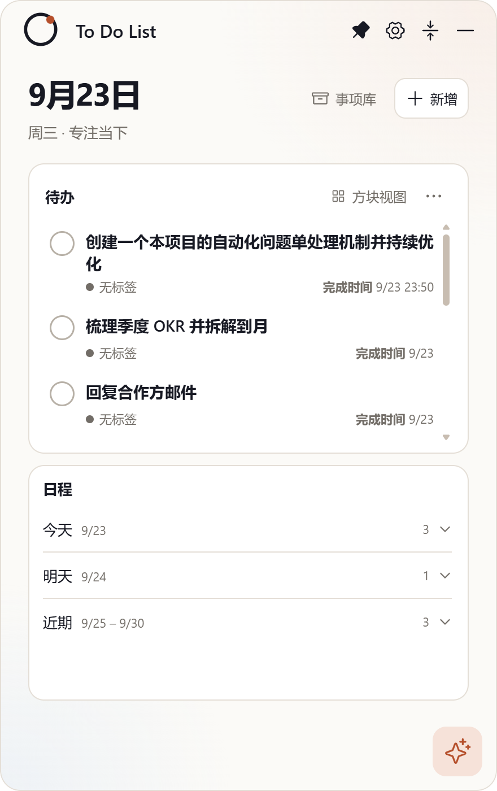
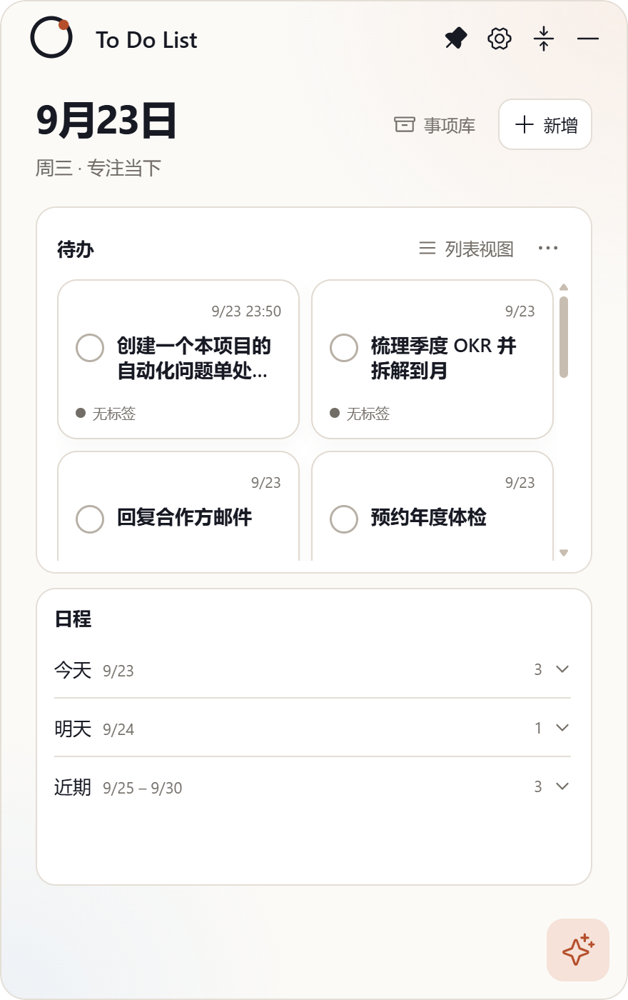

# Issue #14：针对展开状态下的页面，待办和日程各占屏幕上下一半（固定高度、各自内部滚动）

- Issue：<https://github.com/zhshenry/To-Do-List/issues/14>
- 建档：2026-09-23
- 状态：已归档
- 类型：优化
- 涉及UI：是
- 分支：sdd/0014-fixed-split（基于 main `50781b7`；sdd/0014 名被 #16 在途分支占用）

## 背景（issue 要点 + 勘察结论）

**用户诉求**（issue + 截图）：展开态（列表与方块两种模式）待办和日程上下各占固定比例（待办可略多），**高度固定不随内容增减变化**，滚动条做在**各自内部**而非当前的外部整体滚动；「你帮我设计下」。

**勘察**（main `50781b7`）：

- 现状 `.today-board`（`styles.css:81`）是**单一外层滚动容器**（flex:1 + overflow-y:auto），待办卡与日程卡都装在里面——即用户说的「外部整体滚动」；
- JSX（`App.tsx:227-248`）：`.today-board` > `section.plan-card.plan-today`（待办：标题行 + ul.plan-list/.plan-tiles）+ `section.plan-schedule`（日程：标题行 + 今天/明天/近期/更晚分组）；
- 日程分组内 `.plan-folder-body` 自带 168px max-height 内部滚动（嵌套滚动，重做后应取消）。

## 方案（布局示意见 [preview.html](./preview.html) / [fixed-split-proposal.png](./fixed-split-proposal.png)）

- `.today-board` 改 `overflow: hidden`，取消外层整体滚动；
- 两卡变固定比例双区：待办 `flex: 11 1 0`、日程 `flex: 9 1 0`（**55 : 45**，待办略多；随窗口等比缩放，不随内容变化），各 `min-height: 0` 纵向 flex；
- 各卡内部滚动：待办的列表/方块容器、日程的分组容器 `flex: 1; min-height: 0; overflow-y: auto`——标题行（待办/日程 + 视图切换、分组标签）固定卡顶不随滚动；
- 取消 `.plan-folder-body` 的 168px 嵌套滚动（统一交给日程区滚动条）；
- 列表/方块两种模式通用；空态文案不变；不改数据与交互逻辑。

## 实现要点

- `src/styles.css`：约 6-10 行（.today-board overflow、两 section flex 化、内部容器滚动化、plan-folder-body 嵌套滚动移除）。
- `src/App.tsx`：日程分组容器类名微调（如需）。
- 验证：`npm test` + `npm run build` + `npm run test:desktop` 回归（滚动容器变化可能影响可点性断言，playwright 自动滚动兜底）；真机截图（长内容下两区各自滚动、外层不动）。
- CHANGELOG：[未发布] 一条。
- 风险：中低——布局重排但不动逻辑；方块模式网格高度需回归核验。

## 决策记录

- 2026-09-23 建档：比例默认 55:45（待办略多，用户原文「待办多一点」），开放点——用户可在批准时指定其他比例（60:40 / 对半）。
- 2026-09-23 **spec 门**：`deny:ui` → `HUMAN_REVIEW`（UI 类硬政策，未调用 Jev，无概率表）。
- 2026-09-23 **并发让位**：#17/#18/#19/#21（0.6.0 设计线）已占 spec待审，本单 spec 就绪退回排队让位；评论先行有效，可随时审批。
- 2026-09-23 **晋级 spec待审**：0.6.0 线四单撤除 sdd 标签移出流水线，spec 位释放，本单正式占位等审（里程碑评论不变）。
- 2026-09-23 **批准**（issue 评论 `/approve` 01:07，来源:用户(/approve)）：按 55:45 方案实现（未附其他比例）。
- 2026-09-23 **accept 门**：`deny:ui` → `HUMAN_REVIEW`（UI 类不自动放行，未调用 Jev，无概率表）。

## 验收记录

- **交付 commit**：`be3ac90`（后 rebase 为 `df2bf4d`）@ `sdd/0014-fixed-split`，2 文件 +10/−7：`src/styles.css`（today-board 外层 `overflow:hidden`、待办 `flex:11 1 0` / 日程 `flex:9 1 0` 双区固定、两卡内容容器 `flex:1 + overflow-y:auto`、日程分组 168px 嵌套滚动移除——含短窗口媒体查询同步清理）、`CHANGELOG.md` 一条。App.tsx 无需改动（`.plan-schedule-groups` 容器已存在）。
- **验证**：`npm test` 37/37 · `npm run build` · `npm run test:desktop` **passed**。
- **真机证据（程序断言全过）**：列表模式 ——外层 board 零滚动（scrollHeight 488 = clientHeight 488）、待办列表内部滚动（543 > 197）、实测比例 **55.2%**；方块模式 ——网格同样在待办卡内部滚动。截图脚本 [capture-delivered.mjs](./capture-delivered.mjs)。
- **Jev accept 门**：`deny:ui` → `HUMAN_REVIEW`（UI 类人工终审，来源:jev(v2, deny:ui 未调用命题)）。
- 2026-09-23 **验收通过 + 预合并**（issue 评论 `/approve` 08:57、09:05 两次，来源:用户(/approve)）：基线因 #16 合入漂移 → 分支 rebase 至 main（CHANGELOG 并集解突——首次 amend 前曾短暂带入冲突标记，已当场发现修正并复核为零标记）→ 重跑 37/37 + build + smoke 全绿 → 试合树哈希一致（`71674ec`）→ 主干合并 `177f553` → 先 build 再冒烟 passed。分支/工作树清理完成，关单归档。
- 2026-09-23 **参数漏读披露**：spec 批准评论原附「比例按照60：40」，实现时漏读按默认 55:45 交付；用户其后两次 `/approve` 视为接受 55:45，已按此合入并在关单评论中披露——若需改 60:40 为一行 flex 调整。
