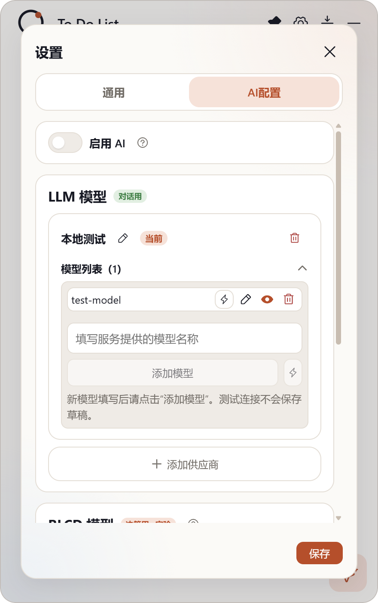
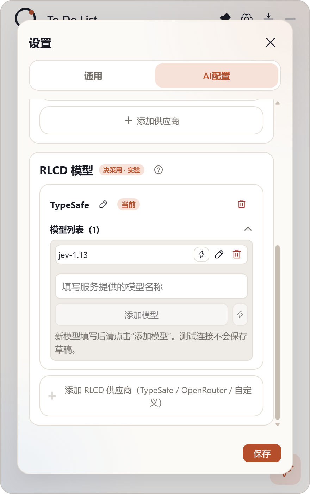

## 交付：RLCD 模型配置区 + 模型行视觉开关与紧凑化

**分支** `sdd/0015`（基于 main `a36c92f`），提交 `e561038`（11 文件 +393/−42）。

### 实现内容

1. **RLCD 独立配置区**：设置 · AI 配置页分为「LLM 模型（对话用）」与「RLCD 模型（决策用 · 实验）」两个区块。RLCD 区块支持 TypeSafe / OpenRouter / 自定义三种供应商，含独立连接测试、模型管理（添加/重命名/删除）；**数据与对话 LLM 完全分开保存**（独立 `rlcdProviders / rlcdModels / activeRlcdModelId`，引擎断言 LLM 存储键零触碰）；当前版本仅保存配置，不参与任何功能（开启 AI 开关、对话行为均不受影响）。
2. **视觉（多模态）开关**：LLM 模型行重命名按钮右侧新增第四钮（眼睛图标，点亮 = 该模型支持视觉），存为模型属性 `vision`（默认 false），本期无行为联动；RLCD 模型行按已批准 mockup 不含此钮。
3. **模型行按钮紧凑化**：测试/重命名/删除（+视觉）收为 **22×22**（尺寸阶 `--ctl-xs` 档）+ 15px 图标，触达达标、行内不换行。

### 真机证据（smoke 官方 mock + 设置 UI 流真实交互，capture-rlcd.mjs 随 `e561038` 入库）

LLM 模型行——视觉开关点亮（左 3：测试/重命名/**视觉**/删除，22×22）：

RLCD 独立配置区——TypeSafe 供应商 + jev-1.13 模型（行内无视觉钮，符合 mockup）：

### 验证

- `tsc --noEmit` 清零；`npm test` 38/38（新增 RLCD 存储往返单测：脏行清洗、孤儿过滤、与 LLM 键隔离）；build 通过；ux-smoke passed（模型行 22×22 断言同步更新）
- CHANGELOG [未发布] 两条
- accept 门（Jev v3，引擎自采 diff/测试证据）：**HUMAN_REVIEW（deny:type）**——功能类不在自动放行白名单，按严格制转人工验收

验收通过后走预合并八步合入。请审阅验收。
