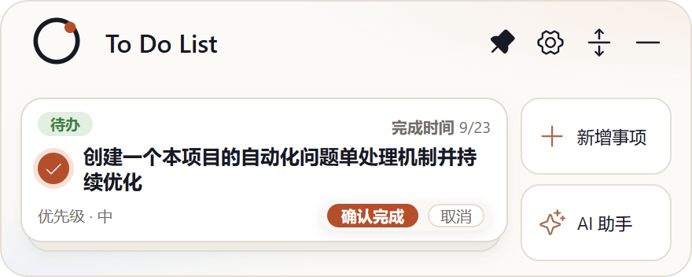
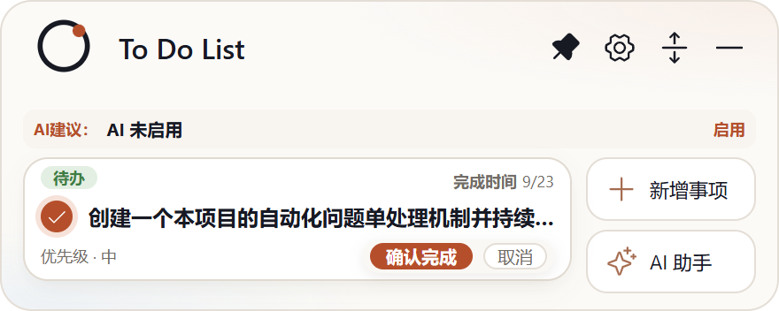

# Issue #16：折叠状态下点击确认按钮挤压标题

- Issue：<https://github.com/zhshenry/To-Do-List/issues/16>
- 建档：2026-09-23
- 状态：已归档
- 类型：缺陷
- 涉及UI：是
- 分支：sdd/0014（基于 main `50781b7`）

## 背景（issue 要点 + 勘察结论）

**用户诉求**（issue + 前后两张截图）：折叠卡点击 ✓ 进入确认态后，✓ 图标、事项名称、标签、进度整体**上移**；怀疑确认完成/取消按钮过高造成挤压；宽版（标准）与窄版（带 AI 建议条）均有。

**勘察**（main `c49d633`，真机实测见 [16-armed-squeeze.png](./16-armed-squeeze.png)）：

- 卡面 `.mini-task-front` 为**固定高度**（标准 92px / 窄版 70px）flex 列；`.front-meta`（分类/进度 + 确认条/翻页器）现为 `min-height: 15px`（窄版 13px）；
- 非确认态底行放 14px 翻页器 → 行高 15px；确认态换成 17px 确认 pill → **行高实测 15→21px（+6px）**，上方 `front-main`（flex:1）被压缩——标题上移 2.3px、圆框上移 2.2px（程序实测数据），与用户截图现象一致；
- 根因归类：**不是按钮「太高」，而是底行没有固定高度**——两种状态的内容高度不同导致几何漂移。

## 方案 v2（按 00:34 /reject 意见修订；真机对照见 [16-armed-squeeze.png](./16-armed-squeeze.png) / [16-armed-fixed-demo.png](./16-armed-fixed-demo.png)，v2 补充截图见验收前提审评论）

底行**固定高度、两态一致** + 按钮按你的意见再压缩：

- **确认按钮去 ✓ 图标**：`MiniCard.tsx` 确认按钮移除 `<Check size={9}>`（取消按钮本无图标，两按钮视觉更一致）；
- **按钮再压一档**：`.confirm-btn` / `.confirm-cancel` `min-height 17→15px`（10px 字号 + 行高 1 的自然内容高 14px，15px 仍有 1px 余量，非硬贴）；
- **底行固定高度**：`.front-meta { height: 16px; }`（标准/窄版统一，窄版 `margin-top: 2px` 保留）——确认 pill 15px 恰好容纳，armed 前后几何完全不变；标准版行高仅比原自然高 1px、窄版 +3px（比 v1 方案的 +4px 更省）；
- 修复演示（运行时注入实测）：armed 态行高与固定值一致，零位移。

## 实现要点

- `src/mini-card.css`：`:63-64` front-meta min-height → 固定 height 16px；`:90-92` confirm-btn/cancel min-height 17→15px。
- `src/MiniCard.tsx`：确认按钮移除 Check 图标。
- 验证：`npm test` + `npm run build` + `npm run test:desktop` 回归；真机截图标准版+窄版各一对（非确认/确认态，标题位置程序断言一致）。
- CHANGELOG：[未发布] 一条。
- 风险：低——固定行高在窄版让出 3px 标题空间（两态一致），交付截图核验。

## 决策记录

- 2026-09-23 建档：用户猜测「按钮太高」方向正确但修法定为**底行固定高度**而非再压按钮（#9 已压到 17px，再压会牺牲可点性）；窄版固定 17px 的标题空间取舍已在上文显式声明，待用户审阅。
- 2026-09-23 **spec 门**：`deny:ui` → `HUMAN_REVIEW`（UI 类硬政策，未调用 Jev，无概率表）。
- 2026-09-23 **/reject（issue 评论 00:34，来源:用户(/reject)）**：两条意见——① 确认完成按钮去掉 ✓ 图标；② 问两按钮高度还有多少挤压空间。采纳：v2 方案按钮 17→15px、去图标，front-meta 相应降为 16px（挤压空间实测仍有富余：10px 字号 + 行高 1 的自然内容高 14px，15px 含 1px 余量）。
- 2026-09-23 **批准**（issue 评论 `/approve` 00:41，来源:用户(/approve)）：按 v2 方案实现。
- 2026-09-23 **accept 门**：`deny:ui` → `HUMAN_REVIEW`（UI 类不自动放行，未调用 Jev，无概率表）。
- 2026-09-23 **验收通过，合入暂缓**（issue 评论 `/approve` 01:02，来源:用户(/approve)）：预合并前置净检查未过——主工作区出现并行会话在途改动（DESIGN.md/PRODUCT.md/UX-CONTRACT.md，非流水线产物），按章程 §6.2 停手不合入。
- 2026-09-23 **用户授权带在途改动合入**（聊天「帮我合入主工作区，有冲突和我说」，来源:用户(聊天)）：改动面与在途文件零交集 → 状态核验 → `_integrate` 试合 + 37/37 → 树哈希一致（`899cebc`）→ 主干合并 `773f834`（**零冲突**，在途改动原样保留）→ 先 build 再冒烟 passed。分支/工作树清理完成，关单归档。
- 2026-09-23 **并发让位（流程自纠）**：spec 就绪时 #13 v3 已占 spec待审位（并发上限 1），本单按章程退回「排队中」让位——里程碑评论已发且持续有效，用户随时可审；#13 了结后下一轮正式置 spec待审。本轮接单时未执行停止条件③检查，已记为流程偏差。
- 2026-09-23 **晋级 spec待审**：#13 已交付实现（spec 位释放），本单正式占位等审（里程碑评论不变）。

## 验收记录

- **交付 commit**：`efe18d3` @ `sdd/0014`（基线 main `50781b7`），3 文件 +6/−5：`src/mini-card.css`（front-meta 固定 height 16px 标准/窄版统一、confirm 按钮 17→15px）、`src/MiniCard.tsx`（确认按钮移除 Check 图标）、`CHANGELOG.md` 一条。
- **验证**：`npm test` 37/37 · `npm run build` · `npm run test:desktop` **passed**。
- **真机证据（双变体程序断言全过）**：标准版 armed ——位移 0.0px、meta 16px、按钮 15px、无图标；窄版 armed ——位移 0.0px。截图脚本 [capture-delivered.mjs](./capture-delivered.mjs)。
- **Jev accept 门**：`deny:ui` → `HUMAN_REVIEW`（UI 类人工终审，来源:jev(v2, deny:ui 未调用命题)）。
