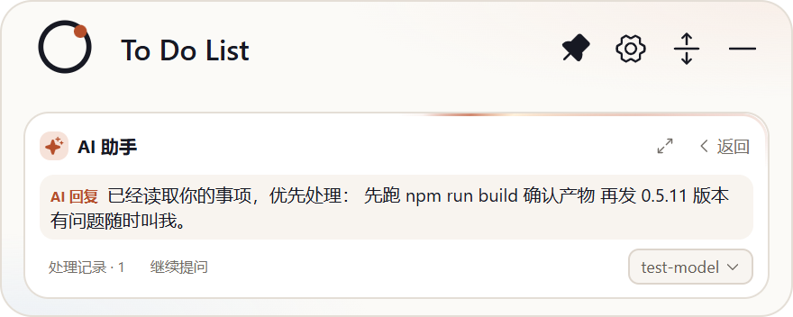
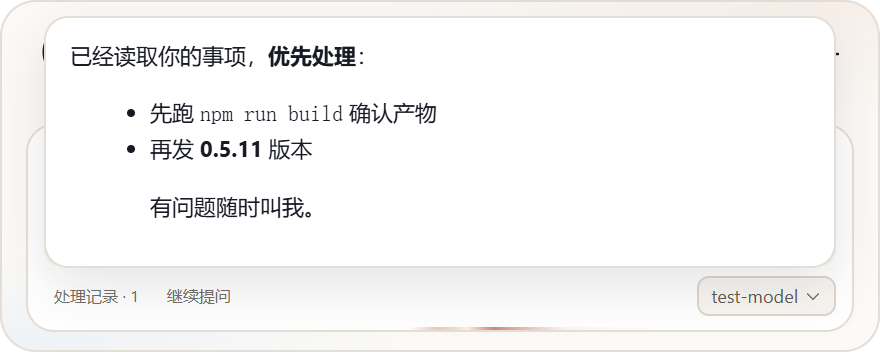
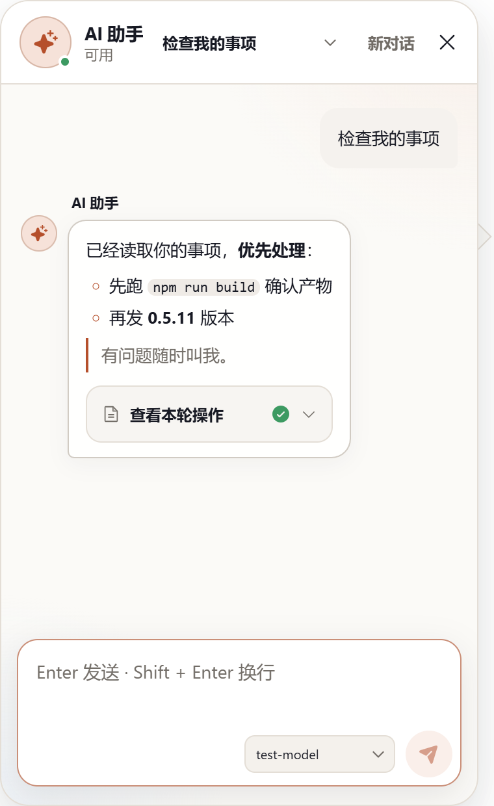

## 交付：AI 回复 Markdown 渲染（一期 + 二期 + 交付缺陷修复）

**分支** `sdd/0017`（基于 main `a36c92f`），三个提交：

- `7ffaa1d` 一期：`src/markdown.ts`（marked GFM+breaks → DOMPurify 净化唯一出口，链接 `target=_blank rel=noopener` 外开）；AIConversation / StandaloneAIConversation 助手气泡接入 `.md-body` 渲染；新增依赖 marked + dompurify；净化用例 5 条。
- `e84506b` 二期：折叠态 `mini-ai-answer` 降级两行截断 + `展开全文 ›` + 悬停 300ms 延迟浮层（portal 至 body，160ms 离开延迟收起；替代原设想的 compactHeight 窗口扩展——体验一致且免去窗口跳动）。
- `b328282` 交付缺陷修复：① dompurify 3.x 实例不暴露 `.window`，`markdownToPlainText` 原实现 `purify.window.document` 抛 TypeError 导致 mini 面首渲染整树崩溃——改为模块加载时捕获 `window`（渲染进程与 jsdom 测试两路通用）；② 删除 compact 渲染体中死代码 `plainAnswer`（无条件调用上述函数，流式/输入态同样中招）；③ 悬浮浮层视口自适应——top 下限钳 8 且 maxHeight 收缩为 `min(300, 视口高 − top − 8)`，修复 176px 迷你窗首行顶出窗缘。

### 真机证据（smoke 官方 mock + 设置 UI 流建供应商，capture 脚本随 b328282 入库）

折叠态降级（纯文本两行 + 展开全文入口）：

悬停浮层（保持完整 Markdown，视口内不裁切，内部可滚动）：

展开全文 → 独立助手窗常驻渲染（含本轮工具记录 chip）：

### 验证

- `tsc --noEmit` 清零；`npm test` 44/44（新增 markdownToPlainText 剥标记/空输入 2 条）；build 通过；ux-smoke passed
- CHANGELOG [未发布] 已记录一条
- accept 门（Jev v3，引擎自采 diff/测试证据）：**HUMAN_REVIEW（deny:type）**——功能类不在自动放行白名单，按严格制转人工验收

范围：纯渲染层 + 折叠态交互，不动后端与数据结构。请审阅验收。
