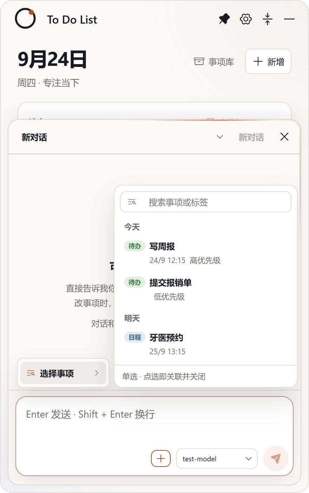
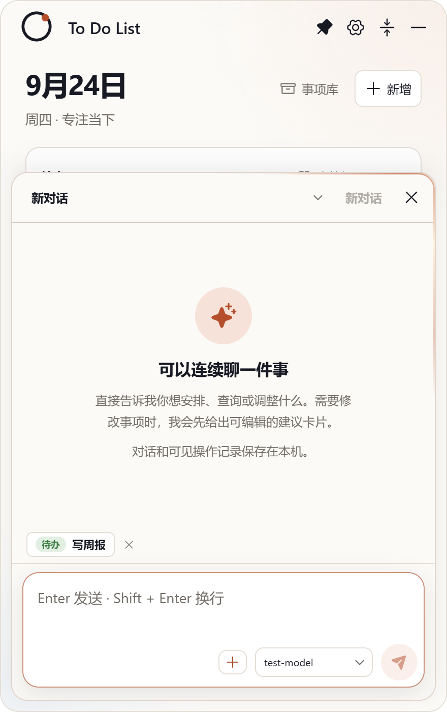
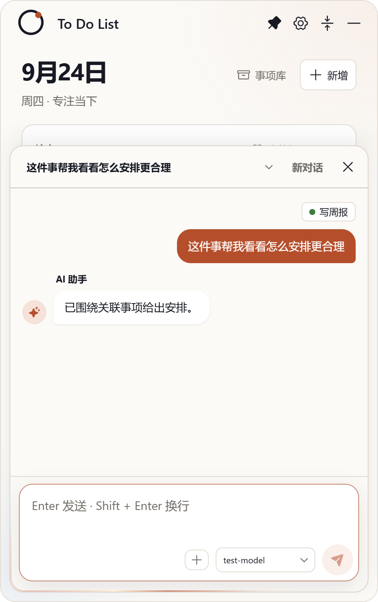
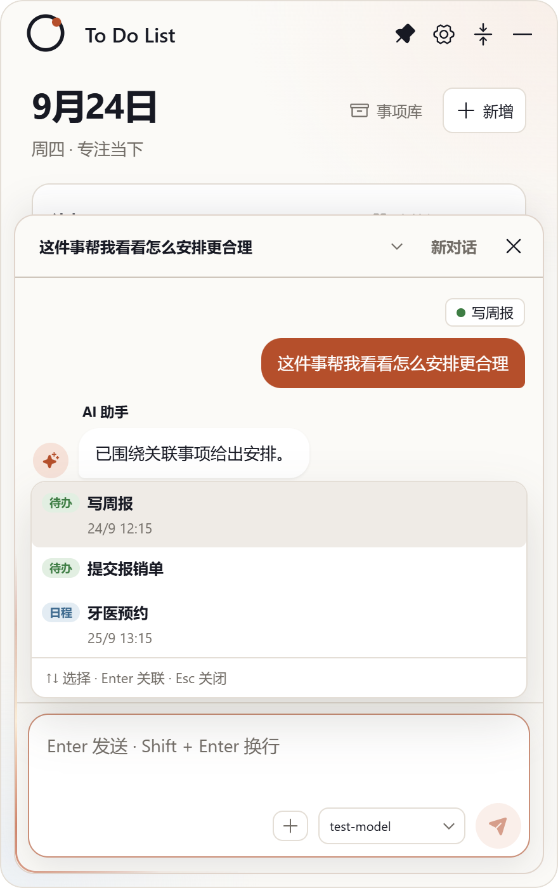
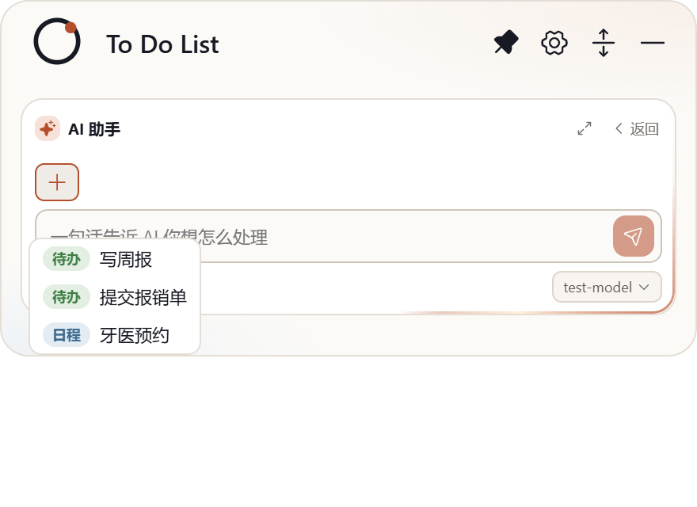

## 交付：AI 对话支持关联已有事项（＋/​/ 选择，单选聚焦上下文）

**分支** `sdd/0018`（基于 main `a45f5a9`），提交 `b55c792` → `184e16c`（6 次提交，含数据链路、选择器 UI、mini 高度修复）。

### 实现内容

1. **关联数据链路**：`chatAsk` / `ChatEntry` 增 `taskId`；发送前校验（已删除/不存在 → 拒绝并提示重选）；主进程把聚焦事项以**全字段区块**注入系统提示词（标题/类型/状态/计划日/截止/提醒/标签名/进度/**备注完整不裁剪**）；历史 ≤12 轮中带关联的消息注入指针；`list_tasks` 与 top-120 快照保持不变——**聚焦不是限定**。
2. **选择器 UI（单选）**：
   - 展开态：输入卡左下角 **＋** → 根菜单「选择事项 ▸」→ 二级面板（搜索 + 今天/明天/近期/更晚/无日期 分组；行 = 类型胶囊 + 标题 + 标签点·时间·优先级 + 勾选）；点行即关联并关闭；
   - 已关联 chip（色点 + 标题 + 标签 + ✕）悬于输入卡上方，点 chip 重开更换；
   - **`/` 快捷**：空输入或空格后键入 `/` 唤出列表（触发符不进输入框），↑↓/Enter/Esc 键盘流；
   - 用户气泡顶部渲染持久化引用 chip（重启后仍在）；
   - 输入区与对话区分隔线。
3. **折叠态**：compose 工具行 ＋ + 截断 chip；**向下弹菜单**（窗口扩展 320px、卡片不换页，无搜索无分组、单行条目）；placeholder 跟随变为 `针对「事项」提问…`；`/` 同样可用。
4. 发送后关联自动清除；`ask_user`/建议等其他 0.6.0 功能不受影响。

### 真机证据（capture-picker.mjs 随提交入库；taskId 持久化 + 聚焦注入断言通过）

展开态二级面板（搜索 + 分组 + 勾选，完整入窗）：

关联 chip（发送前）与用户气泡引用 chip（发送后持久化）：

`/` 快捷菜单与折叠态向下弹菜单（窗口自适应扩展）：

### 验证

- `tsc --noEmit` 清零；`npm test` 53/53（含聚焦注入全量 note 断言、无关联不污染基线 2 条）；build 通过；ux-smoke passed
- CHANGELOG [未发布] 一条
- accept 门（Jev v3，引擎自采 diff/测试证据）：**HUMAN_REVIEW（deny:type）**——功能类按严格制转人工验收

请审阅验收。
