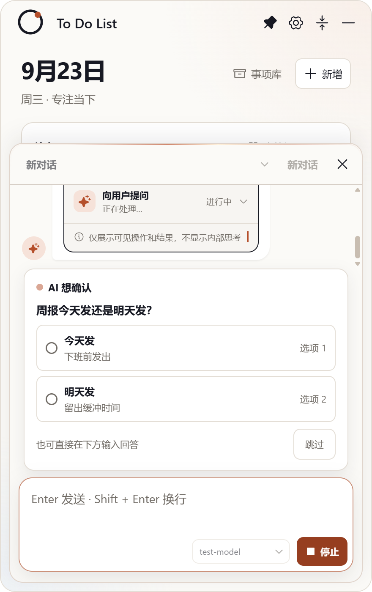
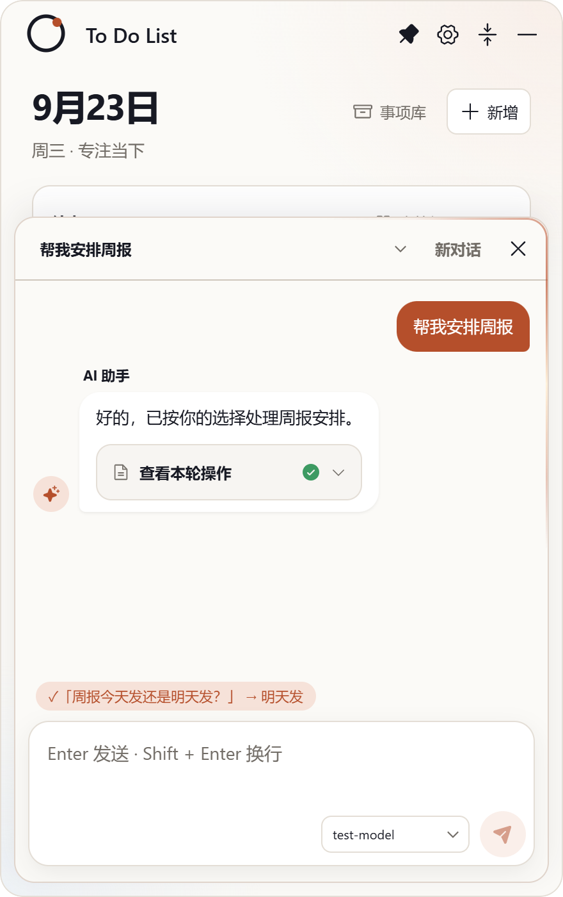
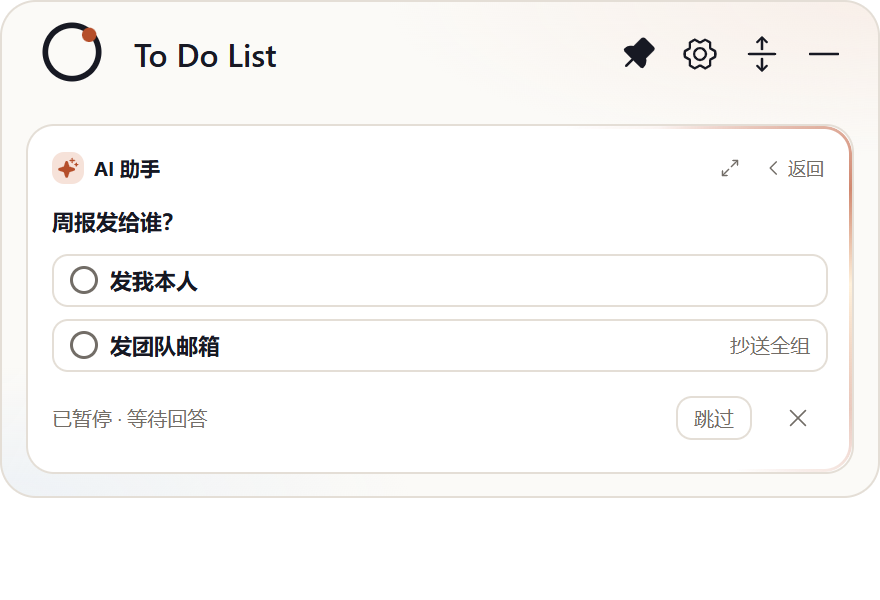

## 交付：AI 助手澄清提问工具 ask_user（循环中途向用户提问）

**分支** `sdd/0019`（基于 main `a36c92f`），提交 `bf9432f` + `de330e3`（10 文件 +230/−14）。

### 实现内容

1. **ask_user 工具**：模型处理中途遇到歧义可调用 `ask_user`（问题 ≤200 字 + 可选 2–4 个带说明的候选选项），**循环暂停等待回答**；工具结果（选项回答/自由输入/跳过/取消）回传模型继续，同一轮内闭环。系统提示词的歧义指引同步升级为优先调用该工具。
2. **分段超时**：模型流式阶段保持 45 秒；**提问挂起期间不计时**（等的是用户不是网络）；点停止/取消时挂起问题落「用户已取消」，循环终止。
3. **三面 UI**：
   - 展开态：transcript 内「AI 想确认」卡片——呼吸点头部 + 问题 + radio 选项（label 加粗 + description 弱化 + 「选项 N」角标），底部「也可直接在下方输入回答 · 跳过」；**输入框直接打字发送 = 回答该问题，不开新轮**（D5）；
   - 回答后收敛单行 `✓「问题」→ 答案`（accent 胶囊），问题与回答写入 `ChatEntry.tools` 持久化，**重启后仍可查看**；
   - 折叠态：`is-asking` 提问视图（窗口扩展至 300px + 内容自适应），底部「已暂停 · 等待回答 | 跳过 | 取消」，头部「展开」可回展开态看完整说明；
   - 窗口全部隐藏时自动弹出助手（D3）。

### 真机证据（smoke 官方 mock 模拟模型调用 ask_user，capture-ask.mjs 随提交入库）

展开态提问卡（选项 + 说明 + 呼吸点）：

选项回答后——收敛单行 + 本轮工具记录 + 最终回复：

折叠态提问视图（300px 扩展 + 双选项 + 暂停/跳过/取消）：

### 验证

- `tsc --noEmit` 清零；`npm test` 39/39（新增：ask_user 循环往返——工具结果回传模型、abort 拒绝落「用户已取消」2 条）；build 通过；ux-smoke passed
- 真机断言：回答后 `ChatEntry.tools` 含 `ask_user` 的 `question/answer`（重启持久化依据）；三面 UI 均以真实点击应答驱动
- CHANGELOG [未发布] 一条
- accept 门（Jev v3，引擎自采 diff/测试证据）：**HUMAN_REVIEW（deny:type）**——功能类不在自动放行白名单，按严格制转人工验收

范围：动 agent 循环与超时语义（风险已按 spec 评估）——无 ask_user 的常规请求路径由既有 39 条测试与 smoke 全量回归覆盖。请审阅验收。
