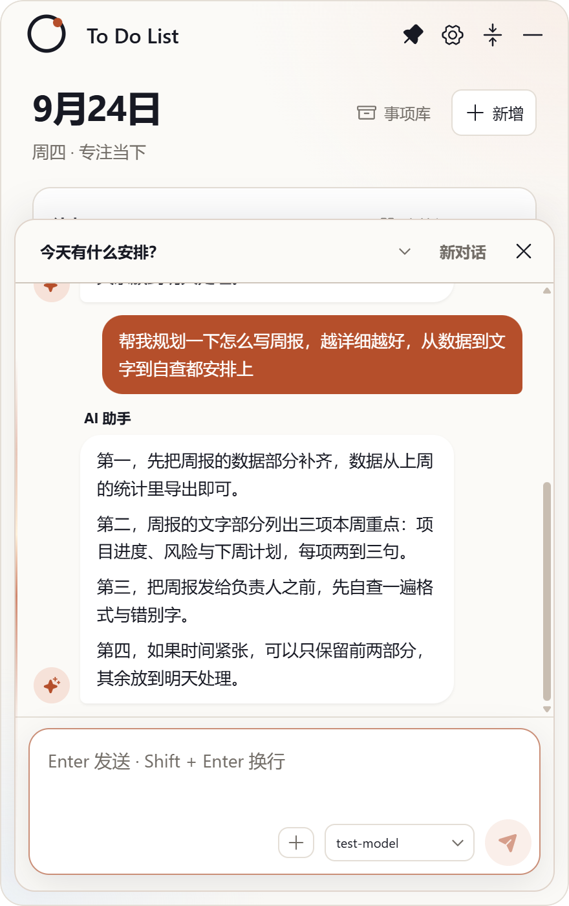
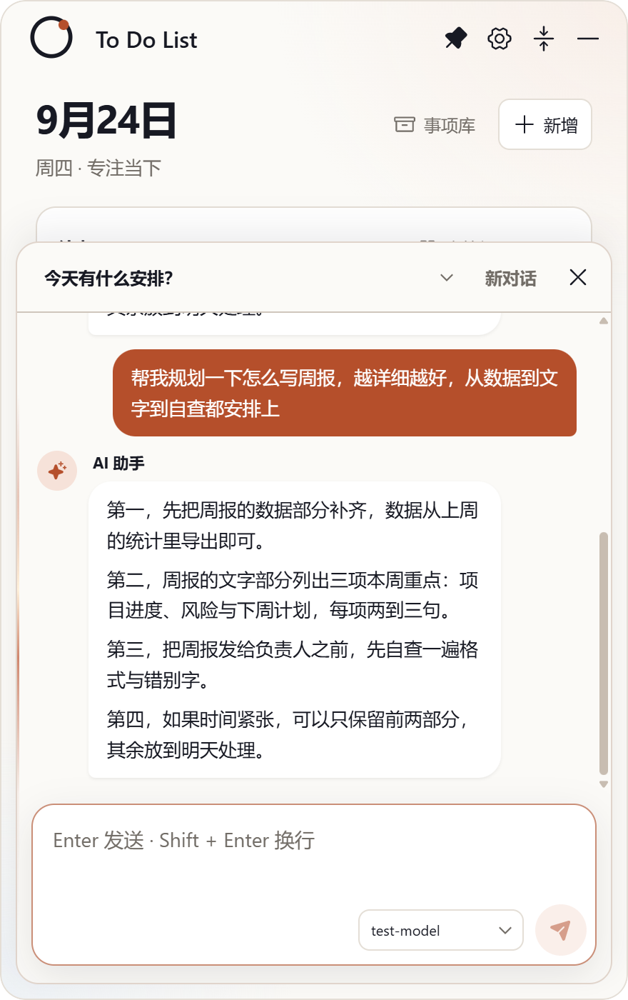

## 交付：AI 助手头像与本人答复顶部对齐（图标错位修复）

**分支** `sdd/0020`（基于 main `a45f5a9`），提交 `45d5bf9`（styles.css 一行覆盖 + CHANGELOG）。

### 修复内容

`styles.css` 新增一行覆盖规则：`.chat-message.assistant .chat-message-row { align-items: flex-start; }`——28px 助手头像不再随 `flex-end` 沉到气泡底部，改为与本人答复行（含「AI 助手」说话人标签）**顶部对齐**；用户行保持底对齐，不受影响。

### 真机证据（修复前 → 修复后，同场景双问句 + 四段长回复）

修复前（头像沉底至「第四…」行旁，即你截图的错位）：

修复后（头像钉在本轮答复顶部）：

### 验证

- 真机数值断言：头像 top 与本轮答复行 top 偏差 **≤4px**（通过；口径说明——答复行顶部含「AI 助手」说话人标签，头像与标签顶对齐，与气泡首行自然衔接）
- `tsc` 清零；`npm test` 51/51；build 通过；ux-smoke passed
- CHANGELOG [未发布] 一条
- accept 门（Jev v3）：**HUMAN_REVIEW**——快车道条件不满足（类型=缺陷不在白名单、spec 无数值契约小节），UI 人工验收

请审阅验收。
