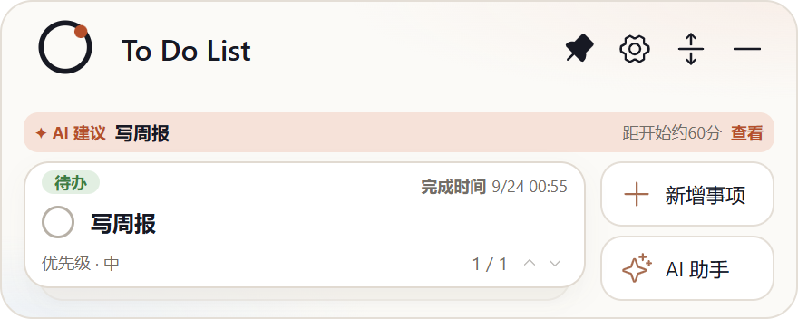

## 交付：AI 建议真 AI 化（折叠卡建议条 · 渐进式增强）

**分支** `sdd/0021`（基于 main `a36c92f`），提交 `beb97bb` + `db99e7f`（8 文件 +363/−10）。

### 实现内容

1. **主进程单次补全**（`electron/insight.ts`，不走 Pi 工具循环）：输入仅今日剩余事项紧凑清单；输出严格 JSON（taskId ∈ 今日剩余 / action 枚举 / context 短语含 `{min}` 占位 / prompt ≤80 字），zod 校验 + 容忍 fenced JSON；**任何失败（非法 JSON / 未知 taskId / 超长 / 超时 10s）→ 静默回退本地规则 `insightTarget`**——建议条永不报错、永不空白、永不直接写数据。
2. **触发与防刷**：接入 `changed()`——90s 防抖、60min TTL、跨天强制、哈希不变跳过、连续失败退避（5→15 分钟）、单飞锁、失败重试 1 次；建议持久化（`insightSuggestion`，含 generatedAt），重启先显旧建议。
3. **UI（渐进式增强）**：AI 生成 → ✦「AI 建议」+ accent 描边浅底（`is-ai`）；本地兜底/未配置 → 「建议」；`{min}` 由渲染层按事项时间本地替换（永不过期、不为刷新重调）；展开预览文案「让 AI 助手处理这条建议……改动先出建议卡，确认后才写入」；点击后的对话 prompt 由 AI 起草 + 主进程统一追加安全后缀。

### 真机证据（smoke 官方 mock；capture-insight.mjs 随提交入库，含安全后缀/标签断言）

未配置引导态（标签「建议」，不占用 AI 名义）：

AI 生成（✦ AI 建议 + `{min}` 已本地替换为 60 分）：

展开预览（AI 起草 prompt + 安全后缀）：

生成失败静默回退本地规则（同样显示「建议」，无 ✦）：

### 验证

- `tsc --noEmit` 清零；`npm test` 41/41（新增解析/回退/`{min}`/哈希 4 条）；build 通过；ux-smoke passed
- 测试中发现并修正 spec 一处自相矛盾：context「≤8 字」与官方示例「距开始约 {min} 分钟」（10 字）冲突——放宽为 ≤16 字符并同步提示词
- CHANGELOG [未发布] 一条
- accept 门（Jev v3，引擎自采 diff/测试证据）：**HUMAN_REVIEW（deny:type）**——功能类不在自动放行白名单，按严格制转人工验收

请审阅验收。
