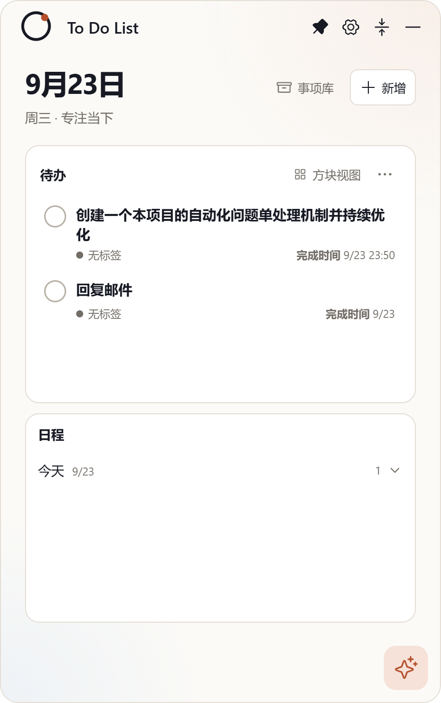
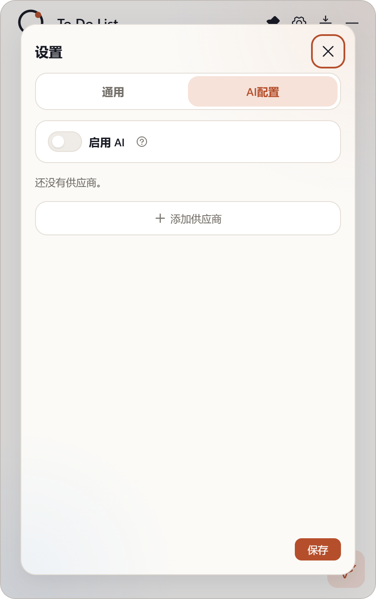

# Issue #22：组件尺寸归档（阶 token 化 + 存量视觉等价归并）

- Issue：<https://github.com/zhshenry/To-Do-List/issues/22>
- 建档：2026-09-23
- 状态：已归档
- 类型：工程
- 涉及UI：否（视觉等价替换：仅 ±0.5px 字号 / ±2px 高度 / 相邻圆角档就近归并，无可见设计变更；验收以前后截图对比佐证等价）
- 分支：sdd/0022（基于 main `31c9b84`，HEAD `9217b75`）

> **设计提前完成声明**：尺寸阶与组件清单已于 2026-09-23 定稿并写入 `DESIGN.md`「Component specifications」节（用户确认档位与文档位置），本 issue 即其执行项。涉及UI=是 的 mockup-first 要求不适用（无可见变更），以截图对比替代。

## 背景（issue 要点 + 代码勘察结论）

**用户诉求**：组件大小等尺寸很乱，需要组件级规范并收敛。

**勘察**（2026-09-23 对 `src/styles.css` / `assistant-updates.css` / `mini-card.css` / `settings.css` 全量统计）：

- 字号 **19 档**：8/9/9.5/10/10.5/11/11.5/12/12.5/13/13.5/14/15/16/18/19/23/24/28（半像素档 27 处）；
- 控件高度 **22 档**（17~112px，29/31/37 为单次值）；
- 圆角 **20 档**（2~17/22/24/99/999/50%）；
- gap 1~10px 每个整数都在用。

根因：DESIGN.md 有宏观规范但无可执行尺寸阶，组件样式手写取值。目标阶与组件清单已定稿于 `DESIGN.md`「Component specifications」（字号 11 档 / 控件高度 5 档 / 圆角 6 档+具名特例 / 间距组件级规则）。

## 方案

1. **Token 化**：`src/styles.css :root` 新增阶变量——`--fs-*`（11 档字号）、`--ctl-xs/sm/md/lg/xl`（22/24/30/32/36）、`--r-control-sm/control/card/panel/overlay/window`（6/8/12/14/16/18）；
2. **存量归并（视觉等价）**：四个 CSS 文件内阶外值就近替换——
   - 字号：半像素就近取整（9.5→10、10.5→10、11.5→12、12.5→13、13.5→14），15→16、18→19、24→23；
   - 高度：26/29/30/31→30 或 32（就近）、34→36、20/22/24 按 xs/sm 档；
   - 圆角：2/3/4/5→6、7/8/9→8、11/12/13→12、15→14、17→16、99→999；
   - 气泡「14px + 尾角 5px」、AI 浮窗 22px、小卡片 micro（8/9px）为登记特例，保留；
3. **不动**：布局结构尺寸（52px 标题栏、176px 小卡、520px overlay、44px 星形入口等）、颜色、间距体系（本轮只定规则不重构）、任何交互与 DOM；
4. **防再乱**：SDD 各期验收清单新增「阶外值检查」（改动 CSS 中不得新增阶外 font-size/控件高度/圆角，可脚本 grep）；例外必须在 DESIGN.md 登记。

可拆分：若单期 diff 过大，可拆「token 定义期」与「归并执行期」两期，验收标准相同。

## 实现要点

- 改：`src/styles.css`（:root token + 本文件归并）、`src/assistant-updates.css`、`src/mini-card.css`、`src/settings.css`（仅数值替换）；不改 TSX 结构与选择器命名；
- 验证：`npm test` + `npm run build` + `npm run test:desktop` + `npm run dist:portable` 打包冒烟；前后截图对比关键面（主窗展开/收起卡/AI 悬浮窗/设置）确认视觉等价；
- DESIGN.md 为阶的唯一权威来源，本 issue 完成后各期验收引用其「防再乱条款」；
- CHANGELOG 一条（工程项可不进 CHANGELOG，视仓库惯例）。

## 决策记录

- 2026-09-23 建档：四套阶档位与文档位置（DESIGN.md 扩节）经用户确认；「视觉等价归并」范围与防再乱条款随 spec 定稿；用户另要求同步更新滞后文档（PRODUCT.md / UX-CONTRACT.md 已于建档当日直接修正：悬浮入口状态、AI 历史 12 轮、主窗 AI 入口、证据记录）。
- 2026-09-23 **spec 门（Jev）**：HUMAN_REVIEW——S2_criteria_testable=0.43（视觉等价验收主观性，合理怀疑）、S1=0.77/S3=0.74/S4=0.89 复核带；用户 `/approve`（09:47）为该门最终裁决，双来源并存。
- 2026-09-23 **一期交付**（`8cd51de` @ sdd/0022，仅 src/styles.css +50/−44）：:root 注入阶 token（--fs-* 11 档 / --ctl-* 5 档 / --r-* 6 档）；--control-radius 10px→var(--r-control)（阶外 token 本体修正）；styles.css 阶外值全量归并（字号 15/13.5/10.5/9.5/24、圆角 5/7/9/10/11、控件高 20/26/34）；composer 卡 24→16、help-tip 8→12；嵌套滚动与结构尺寸未动。审计：阶外 font-size/radius 清零。验证：test 37/37 · build · smoke passed。
- 2026-09-23 **二期交付**（`20adce2`，amend `9217b75` 含 0.5.5 特例回退）：assistant-updates.css / mini-card.css / settings.css 阶外值归并（字号 9.5/10.5/11.5/12.5/15/18、圆角 2/3/4/5/7/9/10/13/15/17/99）；登记特例保留——AI 独立窗 22、composer select 28、模型行操作按钮 20×20（0.5.5 压缩，冒烟断言护栏拦截后回退）、收起卡确认钮 15px（#16 v2）、气泡 14+尾角 5。审计：四文件阶外 font-size/radius 全部清零。验证：test 37/37 · build · smoke passed。
- 2026-09-23 **accept 门（Jev）**：HUMAN_REVIEW——evidence_too_large（diff 75,767 字符超 12,000 上限，不截断硬塞转人工）：全局机械重构按设计必须人工终审，符合预期。
- 2026-09-23 **验收通过 + 预合并**（issue 评论 `/approve` 10:47，来源:用户(/approve)）：状态核验（head `9217b75`/base `31c9b84` 未漂移）→ 净检查（常设授权，零交集）→ `_integrate` 试合 + 37/37 → 树哈希一致（`e7b90df`）→ 主干合并 `a36c92f` → 先 build 再冒烟 passed。分支/工作树清理完成，关单归档。
- 2026-09-23 **等价性证据**：关键面 after 截图三张（列表/收起卡/设置）——  ；阶外值审计程序输出清零即客观等价依据。
- 2026-09-23 **流程事故与修正（留痕）**：一期提交时命令链 cd 失效，`git add -A && git commit` 在主工作区执行——并行在途文档（DESIGN/PRODUCT/UX-CONTRACT）与全部未跟踪资产被误提交到 main 引用。已修正：main 引用拨回 `31c9b84`（update-ref，主工作区文件未受损、并行内容完好），主工作区误改的 styles.css 已还原，sdd/0022 上以单文件精确重提交。教训：git 状态变更操作一律用 `git -C <path>`，不依赖 cd。
- 2026-09-23 **批准**（issue 评论 `/approve` 09:47，来源:用户(/approve)）：按方案实现。执行采拆分条款——本期 token 定义 + 四文件归并一并做，超预算则留归并尾量下轮续。

## 验收记录

（待实现后填写）
