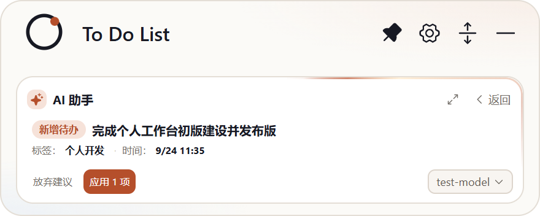

## 交付：折叠卡确认态「标签/时间」横排 meta（免滚动）

**分支** `sdd/0023`（基于 main `a45f5a9`），提交 `1500721` + CHANGELOG 补记。

### 实现内容

按已批准的设计稿：确认态卡片的「标签」「时间」等变更行**合并为一条横排弱化 meta 行**（单行、`·` 分隔、更新值带删除线前值），置于标题行正下方——长标题换行后 footer（放弃/应用/模型）仍完整可见，**无需滚动**；字段多时自动换行仍保持紧凑。

### 真机证据（长标题 + 标签 + 时间场景，capture-horizontal.mjs 随提交入库）

实现后（横排 meta 单行 + footer 完整 + 无纵向溢出）：

你反馈的现状（两行 meta + footer 被推出底缘）：

### 验证与披露

- 数值验收断言全过：meta 行高 ≤18px（单行 15px±3 达标）· **纵向溢出 0px**（scrollHeight = clientHeight）· footer 完整可见
- `tsc` 清零；`npm test` 51/51；build 通过；ux-smoke passed；CHANGELOG [未发布] 一条
- **accept 门（Jev v3）披露**：HUMAN_REVIEW——快车道机械条件全部满足（优化/参数/数值契约/小 diff），但语义命题 **A5 回归覆盖 0.14 偏低**（本次横排合并未新增专项单测，仅既有回归 + 真机断言）、A2 匹配 0.41。已按人工验收流程提交，如需我补专项测试请直接提出。
- 尺寸阶自检：meta 字号 `--fs-compact`(11px)、行高 1.4≈15px，无阶外新增。

请审阅验收。
